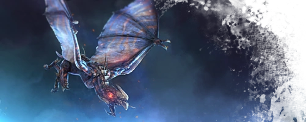
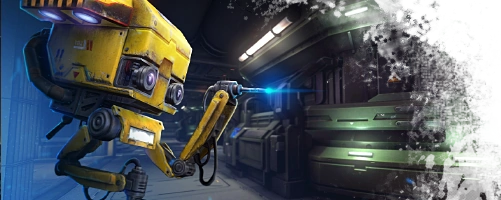

# Changes between revision 1.5 and Vanilla Build 344

 
 

# Alien

### Crag/Shift/Shade/Whip
  - Reduced cost to 8 tres from 13 tres
  - Reduced hitbox by 20%
  - Reduced HP by 20%
  - Increased Speed by 50%

### Fortress Crag/Shift/Shade/Whip
  - Upgradeable version for 24 tres
  - Are able to use ink, echo, healwave without a hivetype
  - Normal hitbox
  - Increased HP by 300%
  - Reduced Speed by 50%
  - Cannot be echo'd
  - Restricted to max 1 of each kind
  - Access to 1 new ability each (3 tres, 10 sec cooldown)
    - CragUmbra: Cast Umbra on all Structures in healrange
    - Hallucinations: Create 5 fake moveable Structures for 30 seconds
    - Shift: Not implemented yet
    - Whip: Not implemented yet

### Whips
  - Fully matured whips attack without infestation

### Onos
- Boneshield
  - Changed so if boneshield is broken it will display even if other weapon is active
- Stomp
  - Stomp will no longer knock Marines over, instead Marines that are hit by a Stomp shockwave will have the full web debuff applied
  - Increased damage from 40 to 50 heavy damage
    - This will increase damage against exos from 80 to 100

### Gorge
- Babblers
  - Babblers will now detach around the gorge instead of everyone at same location above the gorge
  - Babblers will stay out for at least the duration of the babbler ball

### Upgrades
- Carapace
  - Replaced with Heat Plating
- Cloaking
  - Cloaked units' minimap and model visibility based upon proximity corresponding to amount of veils (8m/6m/4m)
  - Player and drifter eggs are now invisible while under the effect of cloak
  - Cloaking-in rate is now fixed at 3 (over 0.33s)
  - Cloaking at 40.1% effectiveness is considered Fully Cloaked, no longer show on enemy minimap and evade AI targetting.
  - Moving Alien players drop below Fully Cloaked threshold when their default max speed is reached.
  - (UI) Changed alien cloak status icon to show only when Fully cloaked.
  - Not-in-combat alien units partially decloak, and have shorter cloaking delay (1.0s instead of 2.5) after being detected, scanned or touched.
  - Camouflage upgrade slows de-cloaking rate, and reduces cloaking delay per level.
  - Cloaking shader tweaked to be more consistent across different backgrounds. It now darkens as it decloaks and 
    includes high frequency distortions to visually camouflage better over distance.
  - Lerk max speed scalar (used to scale cloaking) changed to 9.
- Heat Plating
  - Reduce damage from flamethrower, grenadelauncher, mines, hand grenades and railguns (10% per shell)
  - Decreases duration of fire tick damage from flamethrowers by 33% per shell
- Swapping Trait Cost
  - Swapping to another trait from the same chamber costs less:
    - Skulk: 0 (Same as vanilla)
    - Gorge: 1 (Same as vanilla)
    - Lerk: 2 (Changed)
    - Fade: 3 (Changed)
    - Onos: 4 (Changed)

### Shade Hive
- Hallucination Cloud
  - Replaced Hallucination Cloud with Lesser Ink Cloud, cloaks players, eggs and drifters (including those in combat) for up to 5 seconds.
  - Hallucinated Hive and Harvester will still spawn in their allocated positions.
  - Ink Cloud (& Lesser Ink Cloud) provides enhanced cloaking for 1 second, removes sighted status, and gives improved visual camouflage (minimum 20%) even when in combat.
  - Cloaked Whips are more visible (same as players).

# Marine

### Weapons
- Pulse Grenade
  - Increased damage from 50 to 60

- Railgun
  - Falloff
    - Railguns will deal full damage to targets 15 meters or closer
    - Damage will drop off linearly until a max distance of 30 meters
    - The maximum damage reduction is 50%

### Structures
- Prototype Lab
  - Exotech
    - Exotech is tied to the specific protolab it was researched on.
    - Exotech will be lost when the protolab gets destroyed or recycled.

# Fixes & Improvements

### Armslab
- Hologram
  - Armslabs while researching will show a rotating hologram

### Protolab
- Hologram
  - Protolabs while researching exotech will show a rotating exo hologram
  - Protolabs with exotech available will show a static exo inside an orb

### Scoreboard Points
  - Changed point rewards for building structures from 4 points to be tied to the buildtime
  - Removed point reward for building hydras

### Techtree Map
  - Fixed various visual bugs with updating tech
  - Rerouted techs to illustrate proper tech and structure requirements
  - Replaced babblertech and webs with nutrientmist at bio 1

### Onos
- Stomp
- Implemented Stomp fixes for edge case issues [Link to original mod](https://steamcommunity.com/sharedfiles/filedetails/?id=1082228340)

 

 

Last updated: 2023/09/11
